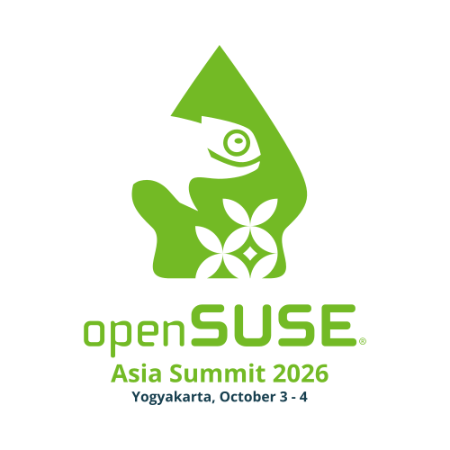
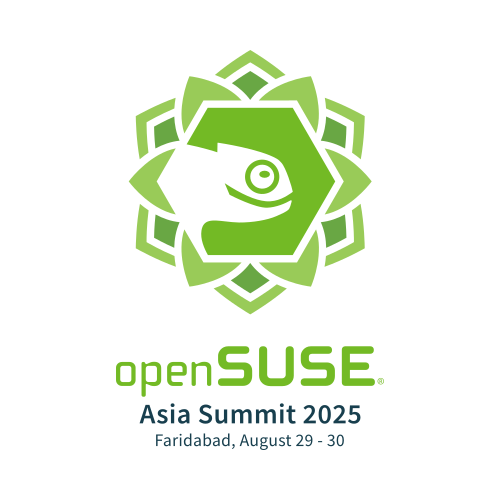
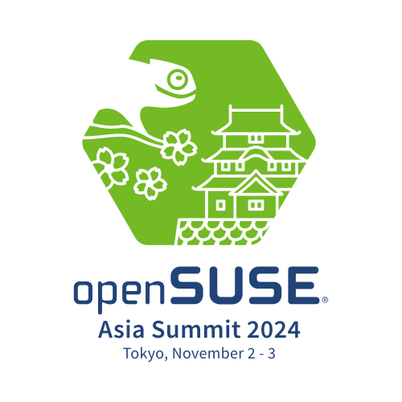
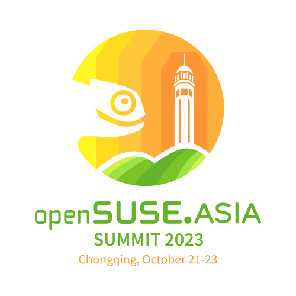
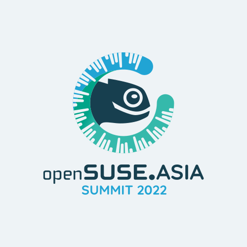
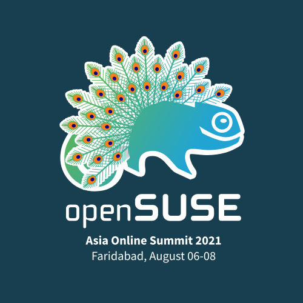

| Year | Location | Logo | Designer | Result | Announcement |
|------|----------|------|----------|--------|--------------|
| 2026 | Yogyakarta, Indonesia |  | A. Thalida | https://news.opensuse.org/2026/08/04/osas-2026-logo-winner/ | https://news.opensuse.org/2026/06/04/opensuse-asia-summit-2026-logo-competition/ |
| 2025 | Faridabad, India |  | Bayu Aji |  | https://news.opensuse.org/2025/04/07/osas-logo-competition/ |
| 2024 | Tokyo, Japan |  | Bayu Aji | https://news.opensuse.org/2024/08/02/os-asia-summit-logo-winner/ | https://news.opensuse.org/2024/05/22/openSUSE-Asia-2024-CFL/ |
| 2023 | Chongqing, China |  | 游栋 | https://forum.suse.org.cn/t/topic/16044 | https://news.opensuse.org/2023/06/01/openSUSE-Asia-2023-CFL/ |
| 2022 | Online |  | Wisnu Adi Santoso |  | https://news.opensuse.org/2022/07/01/osa-cfl/ |
| 2021 | Online |  | Haruo Yoshino |  | https://news.opensuse.org/2021/05/31/osa-logo-competition-announcement/ |
